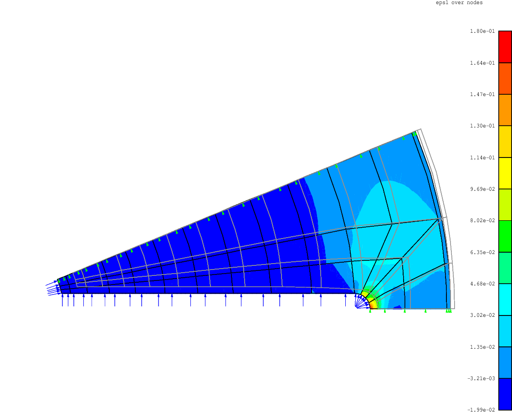

# FEM2D

## Introduction

`FEM2D` forms the core of a collection of codes developed to perform
various analyses on structures using the finite element technique.
Specifically, `FEM2D` is a pre/post-processor used to create two
dimensional finite element models and to interpret the results from
subsequent solutions.  It was developed to handle both "plane" and
axisymmetric two dimensional finite element analysis problems.  It is a
fairly general capability in the sense that a wide variety of two
dimensional problems can be modeled by `FEM2D`.  Other codes are
included to provide a fairly complete analysis capability.  These codes
include the solvers (`Lin2D` and `Nln2D`), a node equivalence
code (`Equ2D`), and a node order optimizer (`Opt2D`).  Of 
course, the user is free to utilize other utility codes to enhance the
operation and functionality of this collection.

The main features of the `FEM2D` collection are as follows:

* two-dimensional plane or axisymmetric problems
* cartesian or polar coordinate systems
* uses `Rexx` macro language
* linear and quadratic isoparametric elements available
* no limit on number of nodes, elements, materials, or boundary conditions (only limited by memory)
* no need to specify problem size (determined at run time)
* group (part) definition/manipulation
* simple draw commands for symbols, lines, and labels
* Dirichlet (constraint) or Neumann (flux), point or distributed boundary conditions
* globally or locally referenced material properties
* laminated materials
* definable post-processing functions
* solution and result superposition
* command aliases for customized uses
* linear and nonlinear (geometric) solvers provided
* solvers use a symmetric banded matrix storage format
* solvers can handle coupled analyses
* node order optimizer for bandwidth reduction
* node equivalence code for part "welding"

## Prerequisites

* [The Regina REXX interpreter - regina-rexx version 3.9.3](https://sourceforge.net/projects/regina-rexx/files/regina-rexx/3.9.3/)
  * [development files - libregina3-dev](https://sourceforge.net/projects/regina-rexx/files/regina-rexx/3.9.3/)
* [Optional] - [Texinfo](https://www.gnu.org/software/texinfo/)

## Documentation

